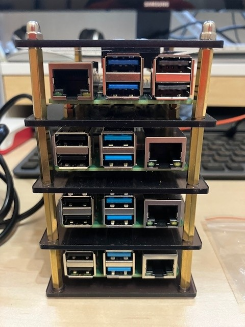
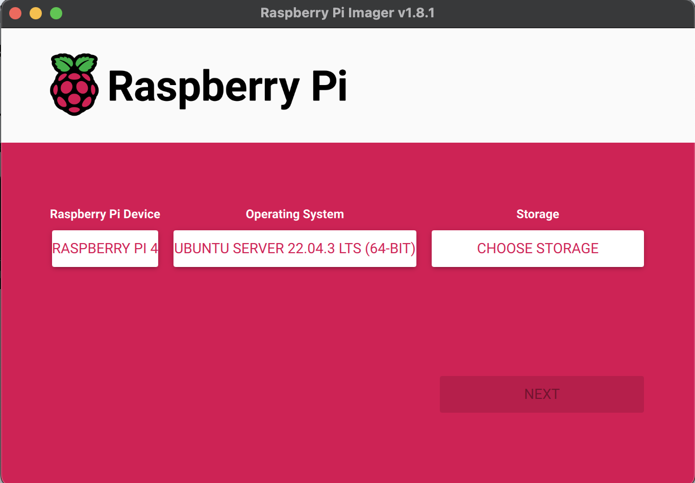
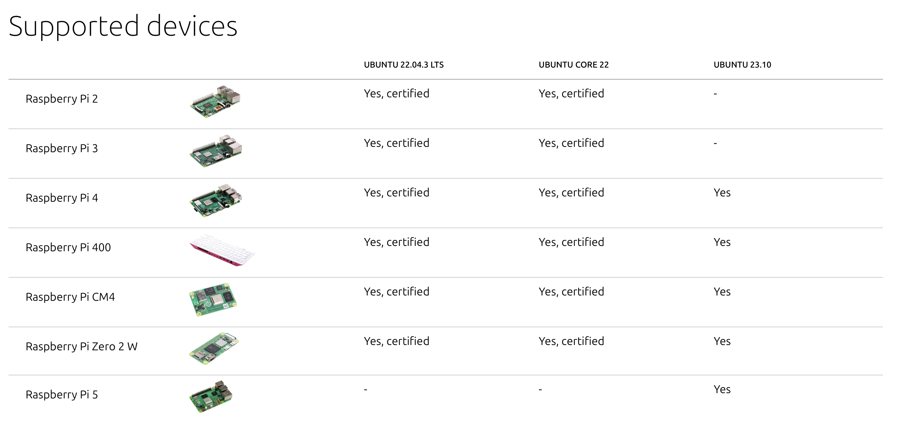

# jarkc
jarkc stands for (just-another-raspberry-kubernetes-cluster)

# Requirements
1. 3x **Raspberry Pi 4 Model B** with a micro SD card and an ethernet port for Worker Nodes
2. 1x **Raspberry Pi 5** with Micro SD card and an ethernet port for Control Node
3. 1x An **Gigabit Ethernet Switch** (5-Port minimum)
4. 1x **Power-Supply** USB-C or other type
5. 4x USB-C to USB-C cable
6. 4x UTP Cable
7. Cluster Case

## My Hardware List

| Device | Description                     | Price (CZK)   | Link                              |  
|--------|----------------------------------|-------------|-----------------------------------| 
| RPis   | 3x Raspberry Pi 4                | 2.199 CZK        | [RPIShop RPI 4](https://rpishop.cz/raspberry-pi-4/2611-raspberry-pi-4-model-b-8gb-ram-0765756931199.html)
|        | 1x Raspberry Pi 5                | 2.299 CZK        | [RPIShop RPI 5](https://rpishop.cz/raspberry-pi-5/6498-raspberry-pi-5-8gb-ram-5056561803326.html)
|        | 1x Gigabit Ethernet Switch (TP-Link TL-SG105E)     | 549 CZK         | [Alza](https://www.alza.cz/tp-link-tl-sg105e-d2916224.htm) 
|        | 4x SD Card 32 GB (SanDisk MicroSDHC 32GB Extreme Pro) | 271,90 CZK | [Alza](https://www.alza.cz/sandisk-microsdhc-32gb-extreme-pro-a1-uhs-i-v30-u3-sd-adapter-d5041152.htm)
| Power  | 1x Power Supply - USB-C (UOUCOO 160 W USB C Charger Multiple)         | 1.594 CZK         | [Amazon](https://amzn.eu/d/gu0fjrM)
|        | 4x USB-C to USB-C Cables         | 59 CZK         | [IKEA](https://www.ikea.com/cz/cs/p/sittbrunn-usb-c-na-usb-c-modra-30546650/)  
|        | 4x UTP Cables                    | 0 CZK         | Self made   
| Case   | 1x Cluster Case (GeeekPi 4 Layer Acrylic Case Dark Brown/Transparent Enclosure)                | 468 CZK         | [AliExpress](https://www.aliexpress.com/item/32918557708.html?spm=a2g0o.order_list.order_list_main.5.11421802lI6NqY)
|        |                                  |            | 
| Total Costs       |                                  |   12.830,90  CZK         |  Approx!!!

# Installation Guide

This guide is based on the following software:

- Raspberry PI Imager v1.8.1 [Raspberry Pi Imager](https://www.raspberrypi.com/software/)

- Ubuntu Server 22.04 (64bit) [Ubuntu 22.04 for RaspberryPi Certified](https://ubuntu.com/download/raspberry-pi/thank-you?version=22.04.3&architecture=server-arm64+raspi)
- Currently supported Ubuntu 23.10 Server (Because I've used Rpi5) [Ubuntu Server 23.10 Rpi5](https://ubuntu.com/download/raspberry-pi/thank-you?version=23.10&architecture=server-arm64+raspi)

- Ansible 2.15.4 [How to install Ansible](https://docs.ansible.com/ansible/latest/installation_guide/installation_distros.html)
- Ubuntu MicroK8s [Link](https://microk8s.io)

